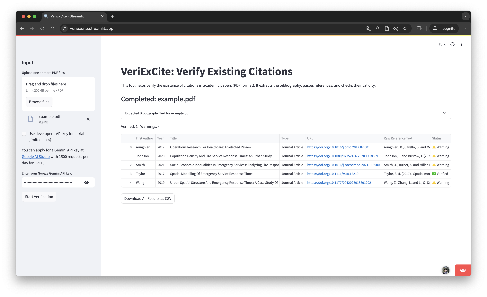
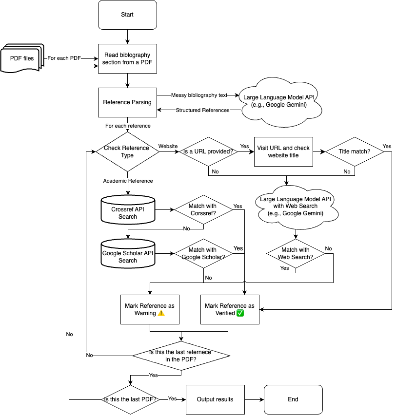

# VeriExCite: Verify Existing Citations

[](https://www.python.org/downloads/) [](https://www.gnu.org/licenses/agpl-3.0)

**VeriExCite** is a Python tool designed to help you verify the existence of citations in academic papers (PDF format). It extracts the bibliography section from a PDF, parses individual references, and then checks their validity against Crossref, Google Scholar, Arxiv, and Google Search.

## Try the Web App (Recommended!)

For quick and easy verification, use our web app: [https://veriexcite.streamlit.app/](https://veriexcite.streamlit.app/) [](https://veriexcite.streamlit.app/) The web app allows you to upload one or more PDF files directly and see the results in your browser. No installation required!

## Why VeriExCite?

The rise of powerful Large Language Models (LLMs) has brought with it the potential for generating realistic-looking, yet entirely fabricated, academic references. While tools like ZeroGPT attempt to detect LLM-generated text, they rely on "black box" deep learning methods, which are prone to both false positives and false negatives, making them unreliable for definitive judgments. However, the presence of fabricated references within a manuscript provides _concrete_ evidence that (at least part) of the text may be LLM-generated. **VeriExCite** focuses on this crucial aspect of academic integrity. It helps academics, teaching assistants, and researchers quickly identify potentially problematic citations.

This flowchart illustrates the VeriExCite process: 

## Features

- **Extraction:** Extracts the bibliography section from PDF documents.
- **Parsing:** Uses Google Gemini API to parse references into structured data (title, authors, DOI, type, etc.)
- **Verification:**
  - Checks academic references against Crossref, Google Scholar, and Arxiv.
  - Checks website references using their URL and Google Search.
  - Identifies potentially fabricated citations.
- **Reporting:**
  - Provides a summary of verified and potentially fabricated references.
  - Outputs results to a CSV file for easy analysis.
- **Folder Processing:** Processes all PDF files in a directory in a single run, suitable for academics and teaching assistants in marking scenarios.
- **Privacy-Conscious:** Only the bibliography section of the PDF is sent to the Google Gemini API. This is crucial for complying with university policies that often prohibit uploading student work (which students hold copyright for) to third-party LLM services. The full text of the paper _is never_ uploaded.

## Usage

While [the web app](https://veriexcite.streamlit.app/) is the easiest way to use VeriExCite, you can also run it locally with Python.

#### Prerequisites

- Python 3.10 or higher
- [uv](https://github.com/astral-sh/uv) - Fast Python package installer and resolver

#### Steps

1. Clone the repository:

```bash
git clone https://github.com/ykangw/VeriExCiting.git
cd VeriExciting
```

2. Install dependencies using uv:

```bash
uv pip install .
```

3. Run the Streamlit app:

```bash
streamlit run streamlit_app.py
```

**Set Google Gemini API Key:**

- Obtain an API key from [Google AI Studio](https://ai.google.dev/aistudio). It's free up to 1500 requests per day!
- Set your API key with `set_google_api_key` function.

**Single PDF File**

```python
from veriexcite import set_google_api_key, veriexcite

GOOGLE_API_KEY = "YOUR_API_KEY"
set_google_api_key(GOOGLE_API_KEY)

pdf_path = "path/to/your/paper.pdf"
count_verified, count_warning, list_warning, list_explanations = veriexcite(pdf_path)

print(f"{count_verified} references validated, {count_warning} warnings.")

if count_warning > 0:
    print("Warning List:")
    for item in list_warning:
        print(item)

print("\nExplanations:")
for explanation in list_explanations:
    print(explanation)
```

**Process a Folder of PDFs**

```python
from veriexcite import set_google_api_key, process_folder

GOOGLE_API_KEY = "YOUR_API_KEY"
set_google_api_key(GOOGLE_API_KEY)

folder_path = "path/to/your/pdf/folder"
process_folder(folder_path)
```

This creates a `VeriExCite results.csv` file in the current directory, including explanations for each reference.

## Interpreting Results

- **Found References:** The total number of references extracted from the bibliography section of the PDF.
- **Validated:** References that were successfully matched in Crossref, Google Scholar, Arxiv (academic references), and Google Search (non-academic websites). If a DOI is provided and matches, the reference is strongly validated. If a DOI is provided but does not match, the reference is flagged as **Invalid**.
- **Invalid:** References that are explicitly flagged as incorrect, such as when a DOI is provided but does not match the Crossref record, or when author/title do not match authoritative sources.
- **Not Found (unverified):** References that could _not_ be verified in any source.
- **Warning List:** The raw text of the unverified or invalid references.
- **Explanations:** For each reference, a detailed explanation is provided, indicating the reason for its status (e.g., "DOI does not match Crossref record", "Author and title match Google Scholar", etc.).

> [!IMPORTANT]
>
> A "warning" or "invalid" from VeriExCite indicates suspicion. Manual verification is always required. The tool now provides detailed explanations for each reference, making it easier to understand why a reference was flagged.

## Streamlit App Output

The Streamlit app now displays:
- **Status**: Shows one of ✅Validated, ❌Invalid, or ⚠️Not Found for each reference.
- **Explanation**: Shows the reason for the status, such as DOI mismatch, author/title match, or not found in any source.

## Contributing

Contributions are welcome! Please feel free to submit issues or pull requests.
